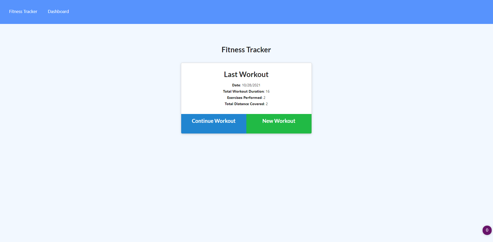
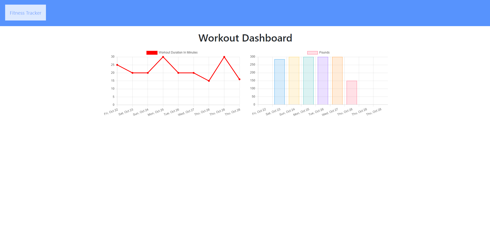

# FitnessFocus  

🚵🏽‍♂️🏊🏽‍♀️⛹🏼‍♂️🏋🏽‍♀️

A fitness app to help you keep track of your progress and goals.


## Description

Fitness Focus is an application that allows the user to create and track their workouts. The user can create a weight based workout or a cardio based workout and the name, weight, sets, reps, or distance can be saved for each. User can also see their progress on their dashboard. Each workout is saved into the MongoD Atlas database. From the dashboard, user can visualize graphs of their progress, one showing their workout duration in minutes, and the other showing their total weight used in the workout. 

## User Story
 
```
As a user, I want to be able to view create and track daily workouts.
I want to be able to log multiple exercises in a workout on a given day. 
I should also be able to track the name, type, weight, sets, reps, and duration of exercise. 
If the exercise is a cardio exercise, I should be able to track my distance traveled.

```






## Table of Contents
1. [Technologies](##Technologies)
2. [Usage](##Usage)
3. [License](##License)
4. [Author](##Author)
5. [Resources](##Resources)
6. [Questions](##Questions)


## Technologies

* Node.js
* express js
* Mongodb
* Mongoose
* [npm morgan ](https://www.npmjs.com/package/morgan)

## Usage

Deployed site on heroku: https://fitness-focus.herokuapp.com/


## License

This repository is under the MIT License.


## Author

👩🏼‍💻 Hannah is a student at Georgia Tech's Full Stack Coding Bootcamp. You can email her at hannahcodes@protonmail.com 📪 or find her github profile [here.](https://github.com/hannahnmcdonald) ✨

## Resources

Below are some of the helpful resources that helped me with this project:

- [MDN- .setDate](https://developer.mozilla.org/en-US/docs/Web/JavaScript/Reference/Global_Objects/Date/setDate)

- [MDN- .getDate](https://developer.mozilla.org/en-US/docs/Web/JavaScript/Reference/Global_Objects/Date/getDate)

- [Mongoose- Aggregate](https://mongoosejs.com/docs/api.html#aggregate_Aggregate)

- [MongoDB- $addFields](https://docs.mongodb.com/manual/reference/operator/aggregation/addFields/)

- [MongoDB- $sum](https://docs.mongodb.com/manual/reference/operator/aggregation/sum/)

## Questions?

Contact me at hannahcodes@protonmail.com 📫

